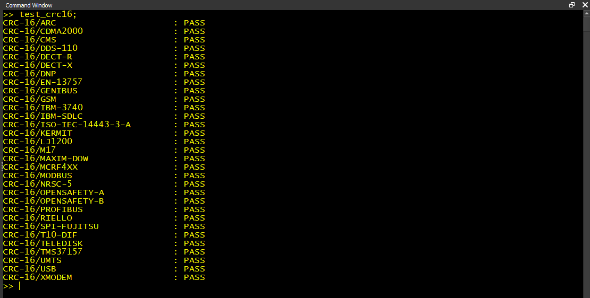

# Table-Driven Implementation of CRC-16

CRC16 is a very readable implementation of CRC-16 which is compatible with MATLAB and GNU Octave. The algorithm is parameterized to support a large number of CRC-16 variants. The following parameters can be specified.
* poly - CRC polynomial specified as a 16-bit integer (default=0x1021)
* init - Initial shift register value specified as a 16-bit integer (default=0)
* refin - Reflect (bit-reverse) input bytes, specified as a boolean (default=false)
* refout - Reflect output CRC, specified as a boolean (default=false)
* xorout - Value to XOR with the final CRC before returning, specified as a 16-bit integer (default=0)

The implementation uses only primitive functions without any dependencies on MATLAB toolboxes or GNU Octave packages. Because of this it will likely run on most any version.  It has been tested with MATLAB versions R2019b, R2020b, and R2022b as well as GNU Octave versions 3.8.2, 6.4.2, and 8.3.0.

# Files
* crc16.m - Table-based CRC-16 algorithm; see the file's embedded help for customizing parameters and usage examples.
* test_crc16.m - Test harness which verifies the algorithm against Greg Cook's *Catalogue of parametrised CRC algorithms with 16 bits*.

# Examples
### 1. CRC16 using default parameters corresponding to CRC-16/XMODEM

~~~~
crc = crc16(uint8('123456789'));
disp(dec2hex(crc))
31C3
~~~~

### 2. CRC-16/KERMIT, often identified as CRC-16/CCITT

~~~~
crc = crc16(uint8('123456789'), struct('refin',1,'refout',1));
disp(dec2hex(crc))
2189
~~~~

### 3. CRC-16/MODBUS

~~~~
cfg = struct('poly',0x8005,'init',0xffff,'refin',1,'refout',1,'xorout',0);
crc = crc16(uint8('123456789'),cfg);
disp(dec2hex(crc))
4B37
~~~~

# References
1. **[Greg Cook's CRC-16 Catalog](https://reveng.sourceforge.io/crc-catalogue/16.htm)**  
2. **[Dr. Dobb's Understanding CRCs](https://www.drdobbs.com/tools/understanding-crcs/184410177)**  
3. **[Sunshine Online CRC Calculator](http://www.sunshine2k.de/coding/javascript/crc/crc_js.html)**  
4. **[Online CRC-8 CRC-16 CRC-32 Calculator](https://crccalc.com/)**  

> Written with [StackEdit](https://stackedit.io/).
